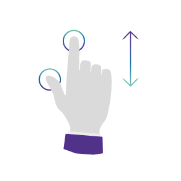
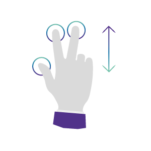
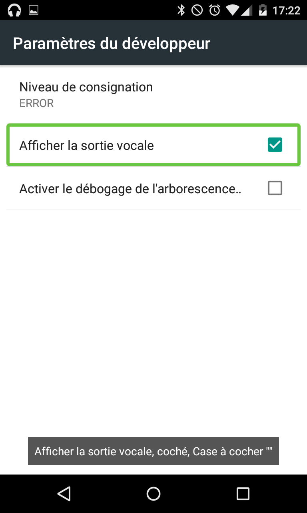
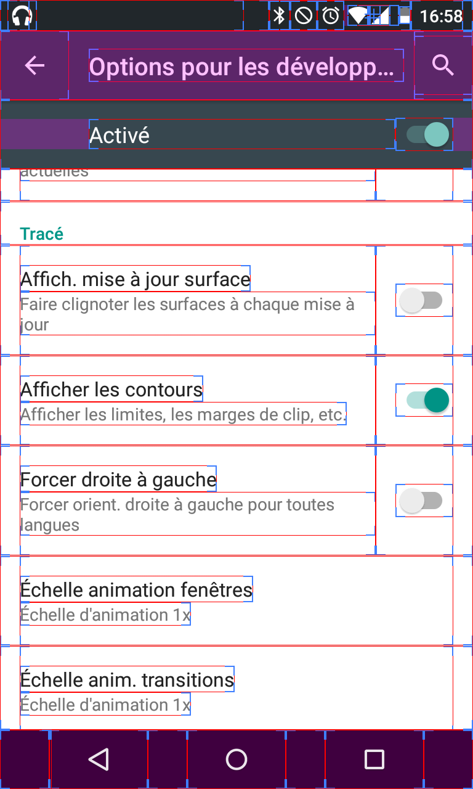
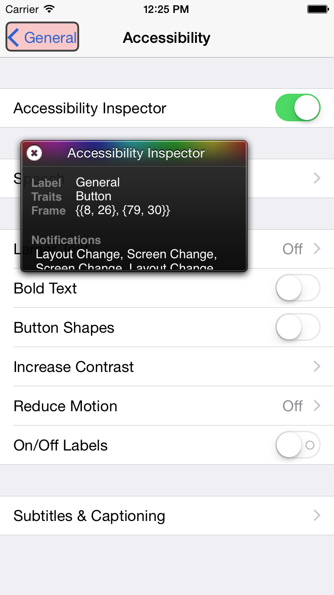
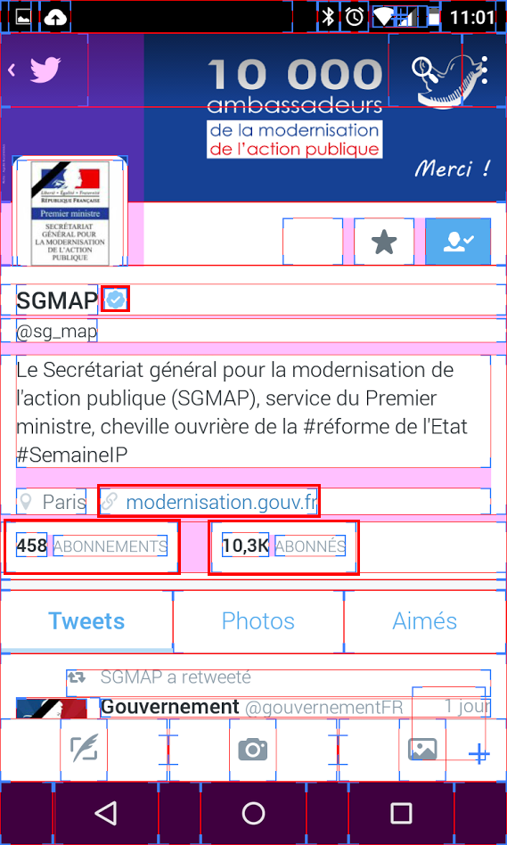
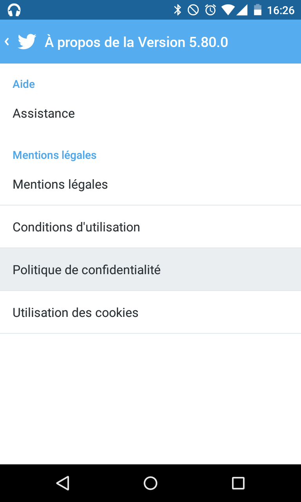
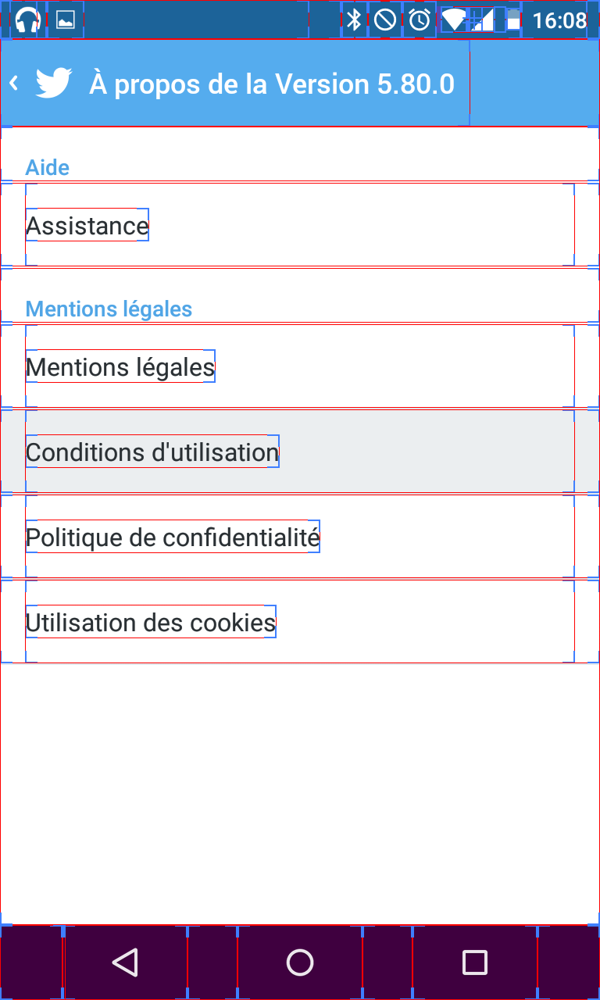
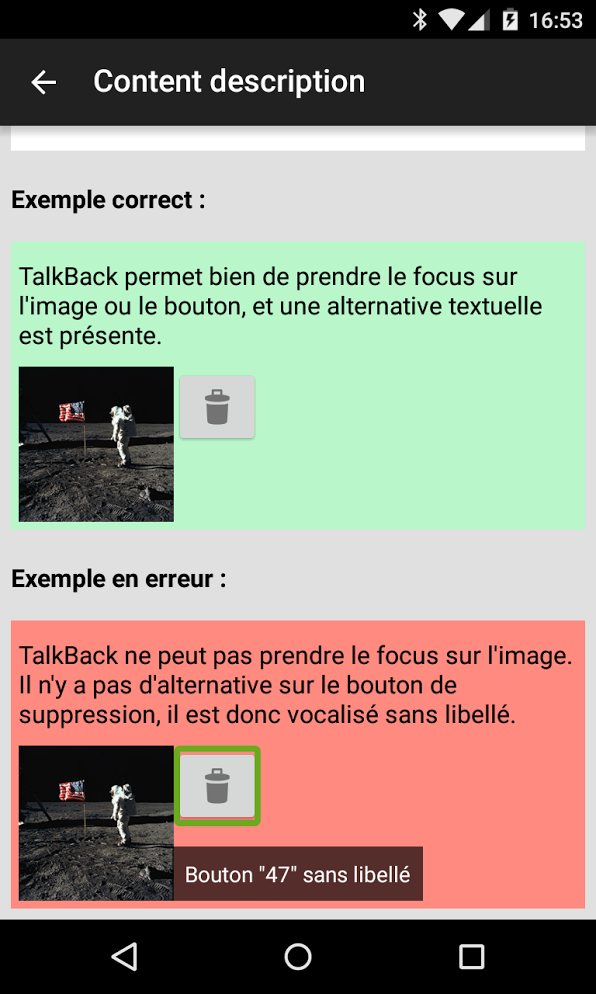

# Guide d'audit d'applications mobiles

## Sommaire

 * [Sommaire](#sommaire)
 * [À qui s'adresse ce guide ?](#%C3%80-qui-sadresse-ce-guide-)
 * [Introduction](#introduction)
 * [I. Présentation des outils d’accessibilité](#i-pr%C3%A9sentation-des-outils-daccessibilit%C3%A9)
   * [Les logiciels](#les-logiciels)
   * [Le matériel](#le-mat%C3%A9riel)
 * [II. Introduction au lecteur d’écran](#ii-introduction-au-lecteur-d%C3%A9cran)
   * [Présentation TalkBack et VoiceOver](#pr%C3%A9sentation-talkback-et-voiceover)
     * [Activer TalkBack sous Android](#activer-talkback-sous-android)
     * [Activer VoiceOver sous iOS](#activer-voiceover-sous-ios)
   * [Gestuelle de base pour réaliser un audit](#gestuelle-de-base-pour-r%C3%A9aliser-un-audit)
     * [Déplacer le focus sur l'élément suivant](#d%C3%A9placer-le-focus-sur-l%C3%A9l%C3%A9ment-suivant)
     * [Déplacer le focus sur l'élément précédent](#d%C3%A9placer-le-focus-sur-l%C3%A9l%C3%A9ment-pr%C3%A9c%C3%A9dent)
     * [Sélectionner l'élément mis en surbrillance](#s%C3%A9lectionner-l%C3%A9l%C3%A9ment-mis-en-surbrillance)
     * [Scroller dans l'application](#scroller-dans-lapplication)
   * [Gestes avancés](#gestes-avanc%C3%A9s)
 * [III. Outils de test pour l’auditeur](#iii-outils-de-test-pour-lauditeur)
   * [Prendre une capture d'écran de l'application](#prendre-une-capture-d%C3%A9cran-de-lapplication)
   * [Activer le mode grands caractères](#activer-le-mode-grands-caract%C3%A8res)
     * [Android](#android)
     * [iOS](#ios)
   * [Afficher la sortie vocale sous Android](#afficher-la-sortie-vocale-sous-android)
   * [Afficher les contours sous Android](#afficher-les-contours-sous-android)
   * [Utiliser l'inspecteur d'accessibilité sous iOS](#utiliser-linspecteur-daccessibilit%C3%A9-sous-ios)
 * [IV. Thèmes](#iv-th%C3%A8mes)
   * [Taille des éléments de l'interface](#taille-des-l-ments-de-l-interface)
     * [Taille des zones sensibles](#taille-des-zones-sensibles)
     * [Marge extérieure suffisante](#marge-ext%C3%A9rieure-suffisante)
     * [Taille du texte](#taille-du-texte)
   * [Images](#images)
     * [Image porteuse d'information](#image-porteuse-dinformation)
     * [Boutons images](#boutons-images)
   * [Couleurs](#couleurs)
     * [Contraste](#contraste)
     * [Information donnée par la couleur](#information-donn%C3%A9e-par-la-couleur)
   * [Multimédia](#multim%C3%A9dia)
     * [Transcription](#transcription)
     * [Sous-titres](#sous-titres)
     * [Lecture automatique](#lecture-automatique)
     * [Notification sonore](#notification-sonore)
   * [Boutons et liens](#boutons-et-liens)
     * [Description des boutons et des liens](#description-des-boutons-et-des-liens)
     * [Informations relatives aux fichiers en téléchargement](#information-relative-aux-fichiers-en-t%C3%A9l%C3%A9chargement)
   * [Structure](#structure)
     * [Menu de navigation à la même place](#menu-de-navigation-%C3%A0-la-m%C3%AAme-place)
   * [Zones de saisie](#zones-de-saisie)
     * [Labels](#labels)
     * [Type input](#type-input)
   * [Focus](#focus)
     * [Éléments focusables](#%C3%89l%C3%A9ments-focusables)
     * [Piège au clavier](#pi%C3%A8ge-au-clavier)
   * [Consultation](#consultation)
     * [Rafraîchissement automatique](#rafra%C3%AEchissement-automatique)
     * [Effet de flash](#effet-de-flash)
     * [Orientation du mobile](#orientation-du-mobile)
 * [Ressources et références](#ressources-et-r%C3%A9f%C3%A9rences)
 * [Guides connexes](#guides-connexes)
 * [Licence](#licence)

## À qui s'adresse ce guide ?

Ce guide présente les étapes à effectuer pour auditer l'accessibilité d'une application mobile. Il s'adresse&nbsp;:
 * Aux développeurs
 * Aux testeurs ou auditeurs

Pré-requis&nbsp;:
 * Être familiarisé avec les principes, les règles et les critères de <abbr title="Référentiel général d'Accessibilité pour les Administrations">RGAA</abbr> 3
 * Connaître les principes de navigation clavier sous <abbr lang="en" title="Personal Computer">PC</abbr>
 * Être familiarisé avec l'<abbr lang="en" title="Operating System">OS</abbr> mobile à tester

## Introduction

Les applications natives mobiles introduisent une nouvelle façon de réaliser les tests.
Il n'est pas possible d'inspecter le code depuis le mobile, ou de naviguer au clavier à la manière d'un PC du fait que le système de navigation soit simplifié sur mobile (commutateurs, geste de navigation…).
Ce nouvel environnement impose au développeur de tester l'application avec les technologies d'assistance. L'environnement d'une application native diffère complètement d'une application web où l'on peut appliquer les normes WCAG. La prise en compte de l'accessibilité doit être adaptée pour répondre à ce nouveau support tactile. De plus, l'accessibilité peut être traitée de façon très différente, d'un OS à un autre, par le développeur. Le lecteur d'écran étant natif à l'OS, le développeur peut introduire des comportements différents suivant le statut du lecteur d'écran, rendant de fait les tests au lecteur d'écran nécessaires.

Ce guide est destiné aux auditeurs voulant vérifier l'accessibilité d'une application mobile native. Il n'est pas nécessaire d'avoir accès au code source, il suffit qu'elle soit installée sur le support cible suivant la version de l'OS à auditer. Le développeur peut aussi utiliser ce guide pour vérifier l'accessibilité de son code.

Le guide a pour but de couvrir les points importants et erreurs récurrentes dans les applications mobiles. Il n'est pas exhaustif, car l'accessibilité sur les supports tactiles est en perpétuelle évolution et n'est pas assez mature. Par défaut, la majeur partie des critères du RGAA 3 s'appliquent, il est nécessaire d'adapter les spécifications techniques (Html/CSS/Js) pour les transposer au natif.

## I. Présentation des outils d’accessibilité

Les personnes en situation de handicap rencontrent des difficultés dans l'accès à l'information (applications, sites Web, etc.). Pour y pallier, elles utilisent des "technologies d'assistance". On peut distinguer deux grandes catégories de technologies d'assistance&nbsp;: logicielles et matérielles.

### Les logiciels

Des logiciels permettent de rendre accessibles les applications mobiles aux personnes en situation de handicap, notamment aux déficients visuels (non et mal-voyants). Ceux-ci sont soit disponibles "par défaut" dans le système d'exploitation et peuvent souvent être activés simplement via les paramètres d'accessibilité, soit installables séparément.

On trouve&nbsp;:

* Les outils d'agrandissement et de modification de l'apparence des caractères&nbsp;: ils permettent à l'utilisateur malvoyant d'agrandir le contenu de l'écran afin d'en prendre connaissance plus facilement.

  * Sous Android, un certain nombre de paramètres sont disponibles (menu **Paramètres > Accessibilité**)&nbsp;:

    * Gestes d'agrandissement&nbsp;: permet de définir de nouveaux gestes permettant à l'utilisateur de modifier la taille des éléments d'interface
    * Grands caractères
    * Texte en contraste élevé
    * Inversion des couleurs
    * Correction des couleurs

  * Pour IOS, les paramètres d'accessibilité permettent de&nbsp;:
    * Activer le zoom
    * Inverser les couleurs
    * Obtenir un affichage en niveaux de gris
    * Afficher des polices plus grandes par défaut
    * Augmenter le contraste

* Les lecteurs d'écran&nbsp;: ces applications permettent aux utilisateurs non et malvoyants d'accéder au contenu affiché à l'écran. Le lecteur d'écran pilote une synthèse vocale et/ou un périphérique externe tel qu'un afficheur braille (voir [Le matériel](#le-mat%C3%A9riel)). Ces logiciels remplissent plusieurs fonctions&nbsp;:
  * Ils permettent à l'utilisateur de parcourir l'écran tactile afin d'en connaître le contenu
  * Ils redéfinissent un certain nombre de gestes pour adapter la navigation dans les interfaces aux utilisateurs déficients visuels
  * Ils vocalisent le contenu&nbsp;: ils sont en mesure de piloter des programmes de synthèse vocale (intégrés au système ou ajoutés par l'utilisateur)
  * Ils pilotent un afficheur braille, un dispositif externe qui sert à restituer le contenu affiché à l'écran et qui peut aussi jouer le rôle d'un périphérique de saisie si l'appareil braille dispose d'un clavier
  * Ils ajoutent un certain nombre de "métaphores sonores" qui sont des sons spécifiques émis pour permettre à l'utilisateur d'identifier plus facilement le contexte dans lequel il se trouve (zone de saisie, début ou fin de liste d'éléments, etc.)
  * Ils proposent des assistances à la saisie

Pour Android, le logiciel TalkBack est un lecteur d'écran livré par défaut (depuis la version 4.0 du système) activable dans les paramètres d'accessibilité. Le système Android intègre un logiciel de synthèse vocale supportant plusieurs langues qui peut être piloté par TalkBack. Les utilisateurs d'afficheurs braille doivent activer le logiciel BrailleBack pour piloter leur appareil.

Les utilisateurs d'iOS peuvent activer le logiciel VoiceOver dans les paramètres d'accessibilité. Il s'agit d'un lecteur d'écran capable de piloter une synthèse vocale (également disponible par défaut avec iOS) et un afficheur braille.

* Les outils de reconnaissance vocale (comme Siri pour iOS) permettent aux utilisateurs qui ont des difficultés à utiliser les interfaces tactiles d'effectuer plus rapidement certaines actions simples (appeler un contact, entrer du texte dans une zone de saisie, etc.).

### Le matériel

L'utilisation des interfaces tactiles peut être facilitée grâce à certains périphériques, souvent connectés via Bluetooth.

On peut citer&nbsp;:

* Clavier&nbsp;: permet aux utilisateurs de naviguer à l'intérieur des interfaces sans utiliser la gestuelle définie par le système&nbsp;; facilite les opérations de saisie.
* Afficheur braille&nbsp;: ce dispositif est utilisé par les personnes aveugles, souvent en complément de la synthèse vocale. Un afficheur braille est constitué d'un ensemble de "picots" qui montent et descendent afin de permettre de produire du braille de manière dynamique. Selon, les modèles, il peut afficher entre 12 et 80 caractères. Il dispose de touches de navigation, et pour certains, d'un clavier braille ou "ordinaire" qui permet de saisir du texte.
* Smartphones adaptés aux personnes en situation de handicap&nbsp;: des fabricants ont créé des modèles adaptés aux personnes en situation de handicap (écran de taille plus importante, présence de touches pour faciliter la navigation, etc.).

## II. Introduction au lecteur d’écran

### Présentation TalkBack et VoiceOver

TalkBack et VoiceOver sont des lecteurs d'écran qui restituent vocalement l'application mobile et vos actions sur celle-ci.
Un lecteur d'écran pour mobile permet de naviguer dans l'application de deux façons&nbsp;:
* En explorant au toucher, le lecteur d'écran restitue vocalement les éléments sous le doigt.
* En utilisant les gestes de navigation, en balayant vers la droite ou vers la gauche, le focus va se déplacer vers l'élément suivant ou précédent.

#### Activer TalkBack sous Android

Avant d'utiliser TalkBack, il nécessaire d'activer plusieurs options dans le menu **Paramètres > Accessibilité > Talkback > Paramètres**&nbsp;:
 1. Activez l'option **Explorer au toucher**
 2. Cochez l'option **Faire défiler les listes automatiquement**

Pour activer TalkBack, procédez comme suit&nbsp;:

 1. Sélectionnez **Paramètres > Accessibilité**.
 2. Suivez les étapes ci-dessous selon votre version d'Android. [Découvrez comment vérifier la version de votre appareil Android](https://support.google.com/nexus/answer/4457705).
   * Android 4.1 ou version ultérieure&nbsp;: sélectionnez **TalkBack**, puis déplacez le curseur de TalkBack en position activée.
   * Android 4.0&nbsp;: sélectionnez **TalkBack**, puis déplacez le curseur de TalkBack en position activée. Revenez ensuite à l'écran précédent, puis activez l'option Explorer au toucher.
   * Android 3.2 ou version antérieure&nbsp;: cochez les cases **Accessibilité** et **TalkBack**.
 3. L'écran de confirmation vous présente une liste d'autorisations concernant l'exécution d'actions précises, qui vous permettront d'obtenir des commentaires audio utiles. Appuyez sur **OK** pour confirmer que vous autorisez ces actions et pour commencer à utiliser TalkBack.

Source&nbsp;:
 * [Activer TalkBack](https://support.google.com/accessibility/android/answer/6007100?hl=fr)
 * [Accessibility testing with Android Talkback (en anglais)](https://www.paciellogroup.com/blog/2015/10/accessibility-testing-with-android-talkback/)

#### Activer VoiceOver sous iOS

 1. Sélectionnez **Réglages > Général > Accessibilité > Raccourci d’accessibilité**
 2. Sélectionnez **VoiceOver**
 3. Vous pouvez maintenant, à tout moment, activer et désactiver VoiceOver en triple cliquant sur le bouton **Home**.

### Gestuelle de base pour réaliser un audit

Les gestes de base permettent de naviguer dans l'application. Le lecteur d'écran lit les éléments en surbrillance. Les gestes permettent de déplacer le focus et d'interagir avec les éléments, un peu à la manière de la navigation clavier sur ordinateur.

#### Déplacer le focus sur l'élément suivant

Pour déplacer le focus sur l'élément suivant, il faut balayer l'écran vers la droite, c'est l'équivalent de la touche `TAB` sur PC.

#### Déplacer le focus sur l'élément précédent

Pour déplacer le focus sur l'élément précédent, il faut balayer l'écran vers la gauche, c'est l'équivalent de la touche `SHIFT+TAB` sur PC.

#### Sélectionner l'élément mis en surbrillance

Pour sélectionner l'élément mis en surbrillance, il faut appuyer deux fois, c'est l'équivalent de la touche `Entrée` sur PC.

#### Scroller dans l'application

Pour scroller dans le contenu de l'application, il existe deux mouvements suivant l'utilisation d'Android ou iOS.

##### Scroller avec Android

Pour scroller avec Android, il faut utiliser deux doigts et glisser dans la direction désirée.

##### Scroller avec iOS

Pour scroller avec iOS, il faut utiliser trois doigts et glisser dans la direction désirée.

### Gestes avancés

[Gestes avancés sous Android](https://support.google.com/accessibility/android/answer/6151827?hl=fr&ref_topic=3529932)

[Gestes avancés sous iPhone (en anglais)](https://developer.apple.com/library/ios/technotes/TestingAccessibilityOfiOSApps/TestAccessibilityonYourDevicewithVoiceOver/TestAccessibilityonYourDevicewithVoiceOver.html)

## III. Outils de test pour l’auditeur

### Prendre une capture d'écran de l'application

Lors de l'audit, il est nécessaire de prendre des captures d'écrans pour pouvoir tester les contrastes. Ces captures pourront alimenter le rapport de l'audit.

Pour prendre une capture d'écran sous iOS&nbsp;:
 * Appuyer en même temps, sur les boutons Home et Power.

Pour prendre une capture d'écran sous Android > 4.0&nbsp;:
 * Maintenir appuyé en même temps pendant quelques secondes, les boutons Volume bas et Power.

### Activer le mode grands caractères

Pour vérifier l'accessibilité de l'application mobile, il est nécessaire de modifier la taille de police lors des test.
Voici la procédure selon l'OS.

#### Android

Pour modifier la taille des caractères sous Android&nbsp;:
 * Dans **Paramètres > Affichage** cliquez sur **Taille de police**.
 * Sélectionnez la taille de police **Très grande**.

#### iOS

Pour modifier la taille de la police sous iOS&nbsp;:
 * Sous iOS 8, rendez-vous dans **Réglages > Affichage et luminosité > Taille du texte**.
 * Sous iOS 7, rendez-vous dans **Réglages > Général > Taille du texte**.
 * Faites glisser le curseur afin d’augmenter ou de réduire la taille de la police.

Source&nbsp;: [Modification de la taille de la police](https://support.apple.com/fr-fr/HT202828)

### Afficher la sortie vocale sous Android

L'auditeur peut faciliter les tests avec le lecteur d'écran en affichant le texte prononcé par la synthèse vocale sous forme de bulle. Elle simplifie aussi les rapports d'audit pour alimenter les impressions d'écran en montrant le focus et la sortie vocale associés à l'écran.

Pour activer l'option, il faut aller dans **Paramètres > Accessibilité > Talkback > Paramètres**, puis dans la section **paramètres du développeur**, cliquez sur **Activer la sortie vocale**.

### Afficher les contours sous Android

Pour les utilisateurs d'Android 4.2 et supérieur, il faut débloquer le mode développeur en allant dans **Paramètres > À propos du téléphone** et taper 7 fois sur l'item **Numéro de build**, puis revenir à l'écran précédent.

Ensuite, aller dans **Paramètres > Options pour les développeurs** et dans la section **Tracé**, cliquez sur l'option **Afficher les contours**.

Cette option peut se révéler utile pour auditer les problématiques de dimensions sous Android. Notamment pour le [critère 14.1](https://github.com/DISIC/referentiel-mobile-tactile/blob/master/refentiel-mobile-tactile-liste-criteres.md#141-chaque-zone-sensible-a-t-elle-une-taille-suffisante) du RGAA.

### Utiliser l'inspecteur d'accessibilité sous iOS

L'inspecteur est activable seulement en ayant accès au code source de l'application.

Pour activer cette option&nbsp;:
 * Importer le projet dans xCode
 * Lancer l'application dans un simulateur iOS
 * Dans l'environnement simulé, cliquez sur le bouton Home
 * Allez dans **Paramètres > Général > Accessibilité**
 * Puis activez l'inspecteur d'accessibilité

Utilisation de l'inspecteur d'accessibilité
 * Il est possible d'activer et désactiver l'inspecteur en cliquant sur le bouton de fermeture de la modale se situant en haut à gauche.
 * Lorsque l'inspecteur est activé, il est possible de connaître les propriétés d'accessibilité d'un élément en cliquant dessus.

De cette manière, il est possible de faire des captures d'écran plus détaillées sur les éléments de l'application.

Dans l'exemple ci-dessous, on peut mettre en évidence le label (General) et le rôle (Button) d'un élément lors d'une capture d'écran donnant ainsi plus d'informations au développeur pour la correction.

Source&nbsp;: [Debug Accessibility in iOS Simulator with the Accessibility Inspector (en anglais)](https://developer.apple.com/library/ios/technotes/TestingAccessibilityOfiOSApps/TestAccessibilityiniOSSimulatorwithAccessibilityInspector/TestAccessibilityiniOSSimulatorwithAccessibilityInspector.html#//apple_ref/doc/uid/TP40012619-CH4-SW1)

## IV. Thèmes

### Taille des éléments de l'interface

#### Taille des zones sensibles

S'assurer que les zones sensibles ont une taille suffisante pour les lire correctement et être activées facilement avec un doigt.
La taille est importante pour les non-voyants explorant au toucher, mais surtout pour les personnes ayant des troubles des mouvements ou de tremblements.
Il est recommandé d'utiliser une hauteur et largeur supérieur à 9mm dans les critères [RGAA 3 pour le mobile](https://github.com/DISIC/referentiel-mobile-tactile/blob/master/refentiel-mobile-tactile-liste-criteres.md#141-chaque-zone-sensible-a-t-elle-une-taille-suffisante).

Android dispose d'une option permettant d'afficher les contours des éléments. Il vous sera nécessaire de déterminer parmis ces éléments lesquel sont des zones sensible au clique.
L'affichage des contours permet de mesurer précisément la taille de la surface sensible qui ne sont parfois pas correctement délimitée dans l'application.

##### Test

1. [Android] [Activer l'affichage des contours](#afficher-les-contours-sous-android)
2. Ouvrir l'application
3. Identifier les zones sensibles
4. Mesurer leurs tailles avec une règle
5. Résultat&nbsp;: Pour chaque zone, la largeur et la hauteur font 9mm au moins.

NB&nbsp;: Sous iOS, il n'y a pas d'option pour afficher les contours. L'utilisation du lecteur d'écran permet de signaler la prise de focus est ainsi mesurer plus facilement la taille de la zone sensible.

##### Exemple

L'exemple ci-dessous comporte plusieurs erreurs en surbrillance, ces zones sensibles ont une taille inféreure à 9mm. L'affichage des contours permet ici de se rendre compte de la taille effective des boutons "ABONNEMENTS" et "ABONNÉS" qui ne comporte pas de délimitation dans l'application.

##### Correspondances

[Critère 14.1 Chaque zone sensible a-t-elle une taille suffisante&nbsp;?](https://github.com/DISIC/referentiel-mobile-tactile/blob/master/refentiel-mobile-tactile-liste-criteres.md#141-chaque-zone-sensible-a-t-elle-une-taille-suffisante)

#### Marge extérieure suffisante

S'assurer que les zones sensibles ont une marge extérieure suffisante pour activer correctement la bonne zone avec un doigt.

##### Test

Les tests de marge peuvent se révéler difficiles à réaliser, spécialement sous iOS qui ne permet pas d'afficher clairement ce détail.

1. [Android] [Activer l'affichage des contours](#afficher-les-contours-sous-android)
2. Ouvrir l'application
3. Identifier les zones sensibles
4. Vérifier qu'il y a une séparation visuelle entre deux éléments ou qu'il y a un espace inactif entre chaque zone sensible.
5. Résultat&nbsp;: Toutes les zones sensibles vérifient l'une des deux conditions.

##### Exemple

L'exemple ci-dessous ne comporte pas d'erreur. Il y a bien une marge visible dans la liste des éléments. Sur la version avec les contours, on peut aussi vérifier qu'il y a une marge de 1 pixel entre chaque élément.

##### Correspondances

[Critère 14.1 Chaque zone sensible a-t-elle une taille suffisante&nbsp;?](https://github.com/DISIC/referentiel-mobile-tactile/blob/master/refentiel-mobile-tactile-liste-criteres.md#141-chaque-zone-sensible-a-t-elle-une-taille-suffisante)

#### Taille du texte

Pour faciliter la lecture, la taille du texte peut être augmentée via les options d'accessibilité. La taille du texte ne doit pas être codée en taille fixe mais en taille relative.

##### Test

1. Ouvrir l'application.
2. Faire une impression d'écran.
3. [Activer l'option **Grands caractères**](#activer-le-mode-grands-caract%C3%A8res).
4. Vérifier la taille du texte après activation de l'option.
5. Résultat&nbsp;: Pour chaque contenu la taille de texte a augmenté, et la lecture n'est pas altérée (i.e. le texte n'est pas tronqué sauf si c'est le comportement attendu et il ne déborde pas).

##### Correspondances

[Critère 10.4 [AA] Dans chaque page Web, le texte reste-t-il lisible lorsque la taille des caractères est augmentée jusqu'à 200%, au moins&nbsp;?](http://references.modernisation.gouv.fr/rgaa/criteres.html#crit-10-4)

[Zoom (en anglais)](http://www.bbc.co.uk/guidelines/futuremedia/accessibility/mobile/design/zoom)

### Images

#### Image porteuse d'information

Une alternative doit être disponible pour chaque [image porteuse d'information](http://references.modernisation.gouv.fr/referentiel-technique-0#title-image-porteuse-dinformation). Lors de la navigation, un non-voyant aura une information sur le contenu de l'image.

##### Test

1. Activer le lecteur d'écran
2. Ouvrir l'application
3. Identifier les images porteuses d'information et prendre le focus
4. Résultat&nbsp;: Pour chaque image porteuse d'information, une alternative est énoncée par le lecteur d'écran.

#### Boutons images

Une alternative doit être disponible pour les boutons icônes ou les boutons images.

##### Test

1. Activer le lecteur d'écran
2. Ouvrir l'application
3. Identifier les boutons image et prendre le focus
4. Résultat&nbsp;: Pour chaque bouton images une description permet d'en comprendre la fonction et la destination.

##### Exemple

Dans l'exemple de l'application de démonstration Android, le bouton image comporte une erreur, en effet le bouton de suppression n'a pas d'alternative permettant de comprendre sa fonction. Le lecteur restitue Bouton "67" sans libellé.

### Couleurs

#### Contraste

Il est important de vérifier que le contraste sur mobile est supérieur à 4,5. Il n'existe pas d'application mobile pour vérifier directement ce critère sur le mobile. Il est nécessaire de faire une impression d'écran et de l'envoyer sur un ordinateur pour vérifier les contrastes.

##### Test

1. Ouvrir l'application
2. Prendre une [capture d'écran](#prendre-une-capture-d-cran-de-l-application)
3. Envoyer la capture par courriel vers un PC.
4. Ouvrir l'image et utiliser la pipette de [Colour Contrast Analyser (en anglais)](https://www.paciellogroup.com/resources/contrastanalyser/).
5. Résultat&nbsp;: Vérifier que le contraste est de 4,5:1 au moins pour tout les textes.

##### Correspondances

[Critère 3.3&nbsp;: Contraste entre la couleur du texte et la couleur de son arrière-plan est-il suffisamment élevé](http://references.modernisation.gouv.fr/rgaa/criteres.html#crit-3-3)

#### Information donnée par la couleur

Vérifier que l'information n'est pas donnée uniquement par la couleur.

##### Test

1. Ouvrir l'application.
2. Identifier tous les éléments utilisant de la couleur.
3. Pour chaque élément, l'information ne doit pas être donnée uniquement par la couleur
4. Résultat&nbsp;: Une information textuelle équivalente à celle donnée par la couleur est présente dans l'interface.

##### Correspondances

[Critère 3.1 [A] Dans chaque page Web, l'information ne doit pas être donnée uniquement par la couleur. Cette règle est-elle respectée&nbsp;?](http://references.modernisation.gouv.fr/rgaa/criteres.html#crit-3-1)

[Critère 3.2 [A] Dans chaque page Web, l'information ne doit pas être donnée uniquement par la couleur. Cette règle est-elle implémentée de façon pertinente&nbsp;?](http://references.modernisation.gouv.fr/rgaa/criteres.html#crit-3-2)

### Multimédia

#### Transcription

Vérifier la présence d'un bouton ou d'un lien proche du média temporel pré-enregistré permettant l'affichage d'une alternative textuelle pertinente.

##### Test

1. Ouvrir l'application.
2. Identifier chaque média temporel pré-enregistré véhiculant une information.
3. Résultat&nbsp;: Pour chaque média restant, il existe un lien adjacente clairement identifiable vers une transcription textuelle pertinente.

##### Correspondances

[Critère 4.1 [A] Chaque média temporel pré-enregistré a-t-il, si nécessaire, une transcription textuelle ou une audio-description (hors cas particuliers)&nbsp;?](http://references.modernisation.gouv.fr/rgaa/criteres.html#crit-4-1)

[Critère 4.2 [A] Pour chaque média temporel pré-enregistré ayant une transcription textuelle ou une audio-description synchronisée, celles-ci sont-elles pertinentes (hors cas particuliers)&nbsp;?](http://references.modernisation.gouv.fr/rgaa/criteres.html#crit-4-2)

#### Sous-titres

Les sous-titres permettent au sourd ou malentendant d'obtenir un équivalent du contenu audio.

##### Test

1. Ouvrir l'application.
2. Identifier chaque média temporel pré-enregistré ayant des paroles, commentaires, ou dialogue.
3. Résultat&nbsp;: Pour chaque média restant, il est possible de visualiser une version avec sous-titres pertinents.

##### Correspondances

[Critère 4.3 [A] Chaque média temporel synchronisé pré-enregistré a-t-il, si nécessaire, des sous-titres synchronisés (hors cas particuliers)&nbsp;?](http://references.modernisation.gouv.fr/rgaa/criteres.html#crit-4-3)

[Critère 4.4 [A] Pour chaque média temporel synchronisé pré-enregistré ayant des sous-titres synchronisés, ces sous-titres sont-ils pertinents&nbsp;?](http://references.modernisation.gouv.fr/rgaa/criteres.html#crit-4-4)

#### Lecture automatique

La lecture automatique de son peut dans certains cas perturber la perception auditive du contenu par l'utilisateur. En effet les non-voyants utilisant un lecteur d'écran, auront alors deux sons en cours de lecture (la synthèse vocale et la lecture automatique) provoquant des confusions sur le contenu de l'application.

##### Test

1. Activer le lecteur d'écran.
2. Ouvrir l'application.
3. Identifier chaque contenu joué automatiquement durant plus de 3 secondes.
4. Pour chaque contenu joué automatiquement, il existe un bouton pour contrôler la lecture.

##### Correspondances

[Critère 4.18 [A] Chaque son déclenché automatiquement est-il contrôlable par l'utilisateur&nbsp;?](http://references.modernisation.gouv.fr/rgaa/criteres.html#crit-4-18)

[Critère 13.17 [A] Dans chaque page Web, chaque contenu en mouvement ou clignotant est-il contrôlable par l'utilisateur&nbsp;?](http://references.modernisation.gouv.fr/rgaa/criteres.html#crit-13-17)

[Autoplay (en anglais)](http://www.bbc.co.uk/guidelines/futuremedia/accessibility/mobile/audio-and-video/autoplay)

#### Notification sonore

Dans une application mobile, il est courant d'utiliser des notifications sonores pour avertir l'utilisateur. Toute notification sonore doit avoir un système secondaire d'avertissement pour les utilisateurs sourds ou malentendants.

##### Test

1. Activer le lecteur d'écran.
2. Ouvrir l'application.
3. Pour chaque notification sonore, il existe une alternative visuelle de l'alerte.

##### Correspondances

[No audio-only feedback (en anglais)](http://developer.android.com/tools/testing/testing_accessibility.html)

### Boutons et liens

#### Description des boutons et des liens

Vérifier que le lien ou button est explicite. L'intitulé ou le contexte permet de comprendre la fonction et la destination.

##### Test
1. Activer le lecteur d'écran.
2. Naviguer sur les boutons et les liens.
3. Résultat&nbsp;: Chaque lien et chaque bouton sont explicites.

##### Correspondances

[Critère 6.1 [A] Chaque lien est-il explicite (hors cas particuliers)](http://references.modernisation.gouv.fr/rgaa/criteres.html#crit-6-1)

[Descriptive links (en anglais)](http://www.bbc.co.uk/guidelines/futuremedia/accessibility/mobile/links/descriptive-links)

#### Informations relatives aux fichiers en téléchargement

Pour chaque lien de téléchargement, des informations relatives à sa consultation doivent être présentes.

##### Test

1. Ouvrir l'application.
2. Repérer les fichiers en téléchargement non produits de manière dynamique.
3. Résultat&nbsp;: Chaque fichier en téléchargement a des informations relatives à son format, à son poids, et si nécessaire, à sa langue.

##### Correspondances

[Critère 13.6 [A] Dans chaque page Web, pour chaque fichier en téléchargement, des informations relatives à sa consultation sont-elles présentes (hors cas particuliers)&nbsp;?](http://references.modernisation.gouv.fr/rgaa/criteres.html#crit-13-6)

### Structure

#### Menu de navigation à la même place

Pour faciliter la navigation et ne pas perdre l'utilisateur dans l'application, il est nécessaire de placer le menu de navigation au même endroit.

##### Test

1. Ouvrir l'application.
2. Naviguer sur l'ensemble des écrans de l'application.
3. Résultat&nbsp;: Le menu est toujours à la même place et dans le même ordre relatif des éléments.

##### Correspondances

[Critère 12.2 [AA] Dans chaque ensemble de pages, le menu ou les barres de navigation sont-ils toujours à la même place (hors cas particuliers)&nbsp;?](http://references.modernisation.gouv.fr/rgaa/criteres.html#crit-12-2)

### Zones de saisie

#### Labels

Chaque zone de saisie doit avoir un label pertinent. Il est important pour l'utilisateur de comprendre le contenu qu'il doit saisir

##### Test

1. Activer le lecteur d'écran.
2. Naviguer sur l'ensemble des zones de saisie de l'application.
3. Résultat&nbsp;: Pour chaque champ de saisie&nbsp;:
   * le label reste affiché à la prise de focus et après saisie.
   * le label est correctement énoncé par le lecteur d'écran et est pertinent.

##### Correspondances

[Critère 11.1 [A] Chaque champ de formulaire a-t-il une étiquette&nbsp;?](http://references.modernisation.gouv.fr/rgaa/criteres.html#crit-11-1)

[Critère 11.2 [A] Chaque étiquette associée à un champ de formulaire est-elle pertinente&nbsp;?](http://references.modernisation.gouv.fr/rgaa/criteres.html#crit-11-2)

[labels (en anglais)](http://www.bbc.co.uk/guidelines/futuremedia/accessibility/mobile/forms/labels)

#### Type input

Vérifier que chaque champ de saisie est associé à un type de saisie pertinent.

##### Test

1. Activer le lecteur d'écran.
2. Naviguer sur l'ensemble des zones de saisie de l'application et ouvrir le clavier.
3. Résultat&nbsp;: Pour chaque champ de saisie, le format de saisie est associé à un type de saisie pertinent et le lecteur d'écran annonce le type de clavier.

##### Correspondances

[Critère 14.8 Pour chaque champ de saisie, le format de saisie attendu est-il, si possible, associé à un type de saisie pertinent&nbsp;?](https://github.com/DISIC/referentiel-mobile-tactile/blob/master/refentiel-mobile-tactile-liste-criteres.md#148-pour-chaque-champ-de-saisie-le-format-de-saisie-attendu-est-il-si-possible-associé-à-un-type-de-saisie-pertinent)

[Keyboard input types (en anglais)](http://www.bbc.co.uk/guidelines/futuremedia/accessibility/mobile/forms/keyboard-input-types)

### Focus

#### Éléments focusables

Vérifier que l'intégralité de l'application est correctement restituée par les lecteurs d'écran dans un ordre logique.

##### Test

1. Activer le lecteur d'écran.
2. Ouvrir l'application.
3. Naviguer sur l'ensemble des éléments de l'application en [balayant vers la droite](#d%C3%A9placer-le-focus-sur-l%C3%A9l%C3%A9ment-suivant).
4. Puis retester en naviguant avec un clavier Bluetooth.
5. Résultat&nbsp;: Chaque élément est correctement focusable dans un ordre logique.

##### Correspondances

[Critère 12.13 [A] Dans chaque page Web, l'ordre de tabulation est-il cohérent&nbsp;?](http://references.modernisation.gouv.fr/rgaa/criteres.html#crit-12-13)

[Focus order (en anglais)](http://www.bbc.co.uk/guidelines/futuremedia/accessibility/mobile/focus/focus-order)

#### Signaler la prise de focus

Vérifier que la prise de focus est correctement signalée.

##### Test

1. Activer le lecteur d'écran.
2. Ouvrir l'application.
3. Naviguer sur l'ensemble des éléments de l'application en utilisant les gestes de base ou un clavier Bluetooth.
5. Résultat&nbsp;: Pour chaque élément la prise de focus est visible.

##### Correspondances

[Critère 10.7 [A] Dans chaque page Web, pour chaque élément recevant le focus, la prise de focus est-elle visible&nbsp;?](http://references.modernisation.gouv.fr/rgaa/criteres.html#crit-10-7)

[Visible focus (en anglais)](http://www.bbc.co.uk/guidelines/futuremedia/accessibility/mobile/design/visible-focus)

#### Piège au clavier

Éviter les pièges au clavier, empêchant la navigation correcte dans l'application.

##### Test

1. Activer le lecteur d'écran.
2. Ouvrir l'application.
3. Naviguer sur les éléments de l'application en utilisant les touches Tab, Shift+Tab, Flèches et Entrée.
4. Résultat&nbsp;: Pour chaque élément de l'application, il est possible d'atteindre l'élément précédent et suivant.

##### Correspondances

[Critère 12.14 [A] Dans chaque page Web, la navigation ne doit pas contenir de piège au clavier. Cette règle est-elle respectée&nbsp;?](http://references.modernisation.gouv.fr/rgaa/criteres.html#crit-12-14)

[Keyboard trap (en anglais)](http://www.bbc.co.uk/guidelines/futuremedia/accessibility/mobile/focus/keyboard-trap)

### Consultation

#### Rafraîchissement automatique

Sous mobile l'écran doit être rafraîchie uniquement sous l'action de l'utilisateur. Le rafraîchissement d'écran automatique peut empêcher l'utilisateur de terminer une tâche en cours ou créer de la confusion pour l'utilisateur.

##### Test

1. Ouvrir l'application.
2. Naviguer sur les éléments de l'application.
3. Résultat&nbsp;: L'application n'est pas rafraîchie automatiquement.

##### Correspondances

[Critère 13.1 [A] Pour chaque page Web, l'utilisateur a-t-il le contrôle de chaque limite de temps modifiant le contenu (hors cas particuliers)&nbsp;?](http://references.modernisation.gouv.fr/rgaa/criteres.html#crit-13-1)

[Page refreshes (en anglais)](http://www.bbc.co.uk/guidelines/futuremedia/accessibility/mobile/scripts-and-dynamic-content/page-refreshes)

#### Effet de flash

Il faut éviter d'afficher des contenus qui changent brusquement de luminosité ou d'utiliser un effet de flash pour éviter de provoquer des crises.

##### Test

1. Ouvrir l'application.
2. Naviguer dans l'application.
3. Résultat&nbsp;: L'application n'utilise pas de flash plus de trois fois dans l'intervalle d'une seconde.

##### Correspondances

[Critère 13.15 [A] Dans chaque page Web, les changements brusques de luminosité ou les effets de flash sont-ils correctement utilisés&nbsp;?](http://references.modernisation.gouv.fr/rgaa/criteres.html#crit-13-15)

#### Orientation du mobile

Le développeur ne doit pas imposer l'orientation du mobile pour accéder au contenu. Le contenu doit être disponible quelle que soit l'orientation.

##### Test

1. Ouvrir l'application.
2. Naviguer sur l'écran en mode portrait.
3. Naviguer sur l'écran' en mode paysage.
4. Résultat&nbsp;: L'application permet d'accéder au même contenu.

##### Exemple

Dans cette exemple en erreur le contenu n'est pas consultable en mode portrait.

Source&nbsp;: [WTF Mobile (en anglais)](http://wtfmobileweb.com/)

##### Correspondances

[14.7 L'accès au contenu ne doit pas dépendre d'une orientation de l'écran (portrait ou paysage), cette règle est-elle respectée&nbsp;?](https://github.com/DISIC/referentiel-mobile-tactile/blob/master/refentiel-mobile-tactile-liste-criteres.md#147-laccès-au-contenu-ne-doit-pas-dépendre-dune-orientation-de-lécran-portrait-ou-paysage-cette-règle-est-elle-respectée)

## Ressources et références

* [Référentiel Technique RGAA 3](http://references.modernisation.gouv.fr/rgaa/criteres.html)
* [Référentiel spécifique aux plateformes mobiles/tactiles](https://github.com/DISIC/referentiel-mobile-tactile)
* <a href="http://www.w3.org/TR/mobile-accessibility-mapping/" lang="en">Mobile Accessibility&nbsp;: How WCAG 2.0 and Other W3C/WAI Guidelines Apply to Mobile</a>
* <a href="http://www.bbc.co.uk/guidelines/futuremedia/accessibility/mobile" lang="en">BBC Standards and Guidelines for Mobile Accessibility</a>
* [Verifying App Accessibility on iOS (en anglais)](https://developer.apple.com/library/ios/technotes/TestingAccessibilityOfiOSApps/TestingtheAccessibilityofiOSApps/TestingtheAccessibilityofiOSApps.html#//apple_ref/doc/uid/TP40012619)
* [Accessibility Testing Checklist on Android (en anglais)](http://developer.android.com/tools/testing/testing_accessibility.html)

## Guides connexes

Les guides suivants peuvent être consultés en complément&nbsp;:

* [Guide de conception d'applications mobiles accessibles](https://github.com/DISIC/guide-mobile_app_conception)
* [Guide de développement d'applications mobiles accessibles avec les API Android et iOS](https://github.com/DISIC/guide-mobile_app_dev_natif)
* [Guide de développement d'applications mobiles hybrides accessibles avec Ionic et OnsenUI](https://github.com/DISIC/guide-mobile_app_dev_hybride)

## Licence
Ce document est la propriété du Secrétariat général à la modernisation de l'action publique français (SGMAP). Il est placé sous la [licence ouverte 1.0 ou ultérieure](http://www.etalab.gouv.fr/licence-ouverte-open-licence), équivalente à une licence <i lang="en">Creative Commons BY</i>. Pour indiquer la paternité, ajouter un lien vers la version originale du document disponible sur le [compte Github de la DInSIC](https://github.com/DISIC).
