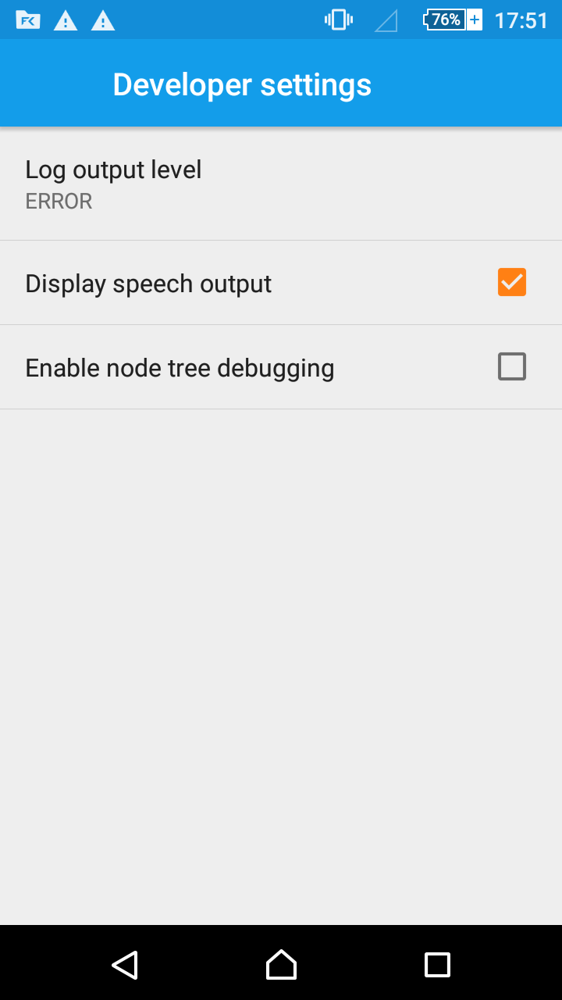
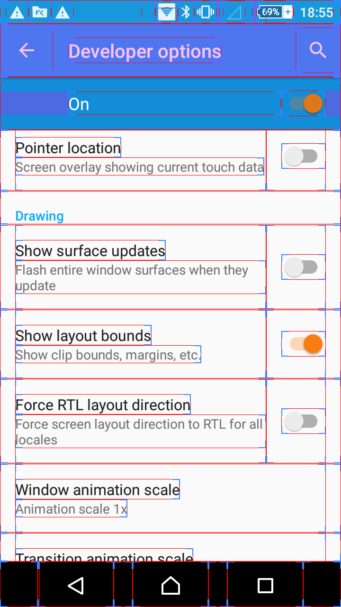
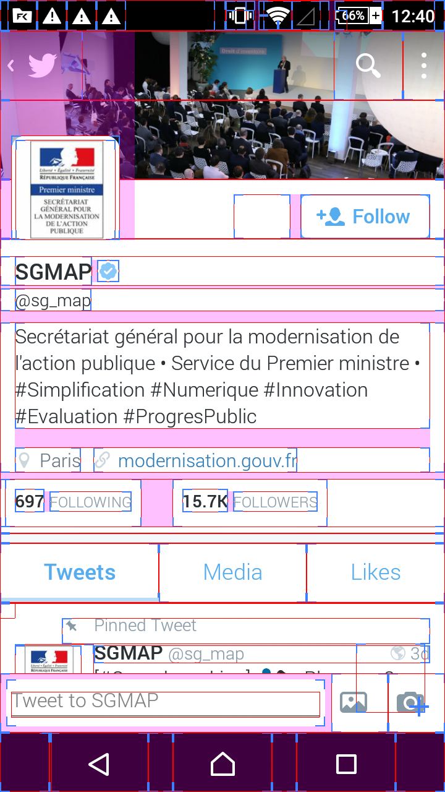
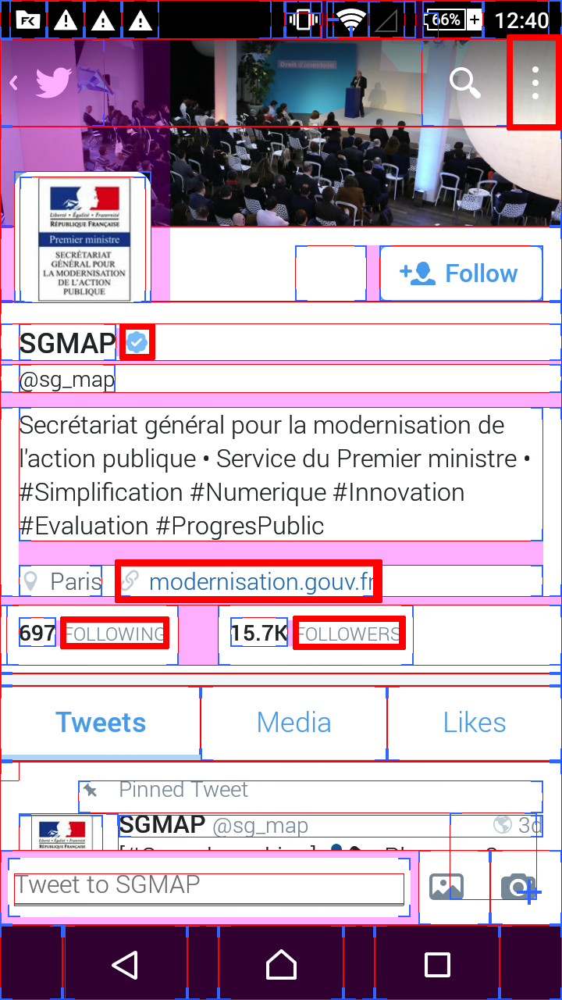
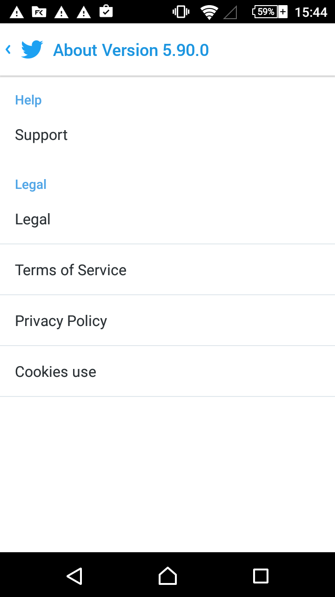
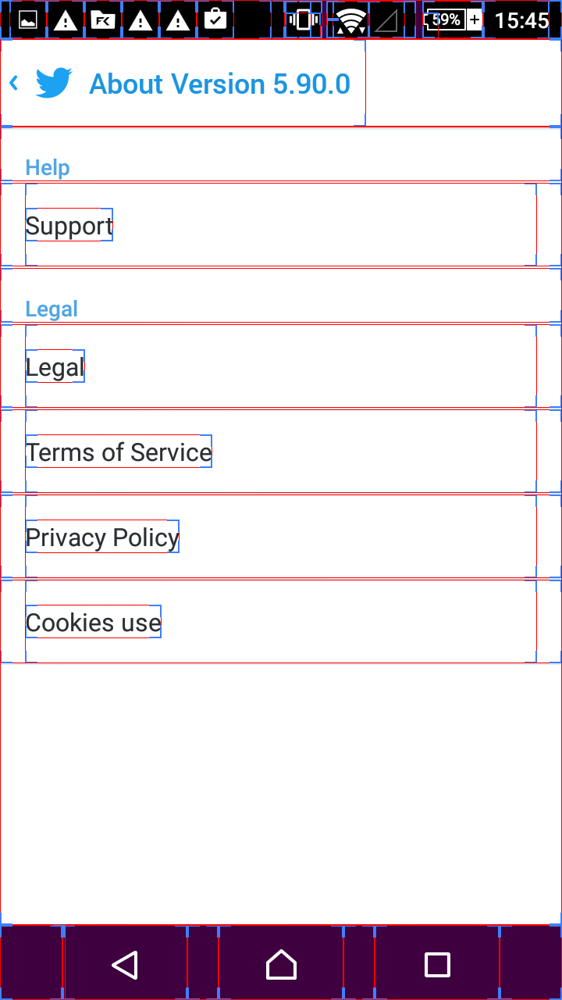

# Mobile app audit guide

## Table of contents

<!-- MarkdownTOC depth="3" -->

- [Who is this guide for?](#who-is-this-guide-for)
- [Introduction](#introduction)
- [I. Presentation of accessibility tools](#i-presentation-of-accessibility-tools)
  - [Software](#software)
  - [Hardware](#hardware)
- [II. Introduction to screen readers](#ii-introduction-to-screen-readers)
  - [Presentation of TalkBack and VoiceOver](#presentation-of-talkback-and-voiceover)
    - [Turn on TalkBack on Android](#turn-on-talkback-on-android)
    - [Turn on VoiceOver on iOS](#turn-on-voiceover-on-ios)
  - [Basic gestures to perform an audit](#basic-gestures-to-perform-an-audit)
    - [Move the focus to the next item](#move-the-focus-to-the-next-item)
    - [Move the focus to the previous item](#move-the-focus-to-the-previous-item)
    - [Select the highlighted item](#select-the-highlighted-item)
    - [Scroll in the application](#scroll-in-the-application)
  - [Advanced Gestures](#advanced-gestures)
- [III. Testing tools for auditors](#iii-testing-tools-for-auditors)
  - [Take a screenshot of the application](#take-a-screenshot-of-the-application)
  - [Enable Large Characters mode](#enable-large-characters-mode)
    - [Android](#android)
    - [iOS](#ios)
  - [Display speech output on Android](#display-speech-output-on-android)
  - [Display layout bounds on Android](#display-layout-bounds-on-android)
  - [Using the Accessibility Inspector on iOS](#using-the-accessibility-inspector-on-ios)
- [IV. Topics](#iv-topics)
  - [User interface elements size](#user-interface-elements-size)
    - [Touch target size](#touch-target-size)
    - [Sufficient outside margin](#sufficient-outside-margin)
    - [Text size](#text-size)
  - [Images](#images)
    - [Image conveying information](#image-conveying-information)
    - [Image buttons](#image-buttons)
  - [Colors](#colors)
    - [Contrast](#contrast)
    - [Information conveyed through color](#information-conveyed-through-color)
  - [Multimedia](#multimedia)
    - [Transcription](#transcription)
    - [Captions](#captions)
    - [Autoplay](#autoplay)
    - [Sound notification](#sound-notification)
  - [Buttons and Links](#buttons-and-links)
    - [Description of buttons and links](#description-of-buttons-and-links)
    - [Downloadable files information](#downloadable-files-information)
  - [Structure](#structure)
    - [Consistent layout for navigation menus](#consistent-layout-for-navigation-menus)
  - [Input fields](#input-fields)
    - [Labels](#labels)
    - [Type input](#type-input)
  - [Focus management](#focus-management)
    - [Focusable elements](#focusable-elements)
    - [Focus visibility](#focus-visibility)
    - [Keyboard trap](#keyboard-trap)
  - [Consultation](#consultation)
    - [Automatic refresh](#automatic-refresh)
    - [Flash Effect](#flash-effect)
    - [Mobile Orientation](#mobile-orientation)
- [Resources and References](#resources-and-references)
- [Related documents](#related-documents)
- [Licence](#licence)

<!-- /MarkdownTOC -->

## Who is this guide for?

This guide presents the steps you need to perform to audit the accessibility of a mobile application. It is aimed at:

 * Developers
 * Testers or auditors

Prerequisites:

 * Be familiar with the principles, rules and criteria of the <abbr lang="fr" title = "Référentiel Général d'Accessibilité pour les Administrations">RGAA</abbr> 3;
 * Know the keyboard navigation principles with a <abbr title = "Personal Computer">PC</abbr>;
 * Be familiar with the mobile <abbr title = "Operating System">OS</abbr> used for testing.

## Introduction

Native mobile applications introduce a new way to carry out accessibility testing.
It is not possible to inspect the code from the mobile device, nor to navigate the keyboard like with a PC, because the navigation system is simplified on mobile (switches, navigation gestures&hellip;).
This new environment requires from the developer to test the application with assistive technologies. The environment of a native application differs completely from a web application where WCAG standards can be applied. Accessibility guidelines must be adapted to comply with the specificities of this new tactile support. In addition, accessibility can be supported very differently, from one OS to another, by the developer. Because the screen reader is native to the OS, the developer can introduce different behaviors depending on the status of the screen reader. This possibility makes testing with a screen reader a necessary step.

This guide is intended for auditors who want to check the accessibility of a native mobile application. It is not necessary to have access to the source code, the only requirement is that the app is installed on the target device, for the various tested OS. Developers can also use this guide to check the accessibility of their app.

The guide aims to cover important issues and recurring errors in mobile applications. It is not exhaustive, because accessibility on tactile/mobile devices is in continuous evolution, and is not mature enough yet. By default, the majority of the criteria of the RGAA 3 apply, however it is necessary to adapt the technical specifications (Html/CSS/JS) to transpose them to native apps.

## I. Presentation of accessibility tools

People with disabilities face difficulties in accessing information (applications, websites, etc.). To compensate, they use "assistive technologies". There are two main categories of assistive technologies: software and hardware.

### Software

Some software applications can make mobile applications accessible to people with disabilities, especially people with visual impairments (blind or with low vision). These are either available "by default" in the operating system (and can often be activated simply via the accessibility settings), or they can be installed separately.

Main categories:

* Tools to enlarge and modify the appearance of characters: they allow the visually impaired user to enlarge the contents of the screen for easier access.

  * On Android, a number of settings are available (menu **Settings > Accessibility**):

    * Magnification gestures: allows you to define new gestures allowing the user to modify the size of the interface elements
    * Large print
    * Text in high contrast
    * Invert colors
    * Color Correction

  * For iOS, the accessibility settings allow to:
    * Enable Zoom
    * Invert colors
    * Get grayscale display
    * Display larger fonts by default
    * Increase contrast

* Screen Readers: These applications allow users to access the content displayed on the screen, in a non-visual way. The screen reader drives a speech synthesizer and/or external device such as a Braille display (see [Hardware](#hardware)). These apps fulfill several functions:
  * They allow the user to explore the interface by touch, to discover its contents
  * They redefine a number of gestures to adapt navigation in interfaces for users with visual impairments
  * They vocalize the content: they are able to control voice synthesizing programs (integrated in the system or added by the user)
  * They operate a Braille display, an external device which is used to display in Braille characters the contents on screen, and which can also act as an input device if it includes a keyboard
  * They add a number of "audio cues" that are specific sounds emitted to allow the user to more easily identify the current context (input area, beginning or end of a list of items, etc.)
  * They offer input assistance

For Android, TalkBack is a screen reader provided as default (since version 4.0), that can be activated in the accessibility settings. The Android system integrates multi-language speech synthesis software that can be controlled by TalkBack. Braille displays users must activate the BrailleBack software to control their device.

iOS users can activate VoiceOver in the accessibility settings. This screen reader is able to drive a speech synthesizer (also available by default with iOS) and a braille display.

* Speech recognition software (like Siri for iOS) allow users who have difficulty using touch interfaces to perform some simple actions more quickly (call a contact, enter text in an input box, etc.).

### Hardware

The use of touch interfaces can be facilitated by some devices, often connected via Bluetooth.

We can mention:

* Keyboard: allows users to navigate within interfaces without using the system-defined gestures. Facilitates input operations.
* Braille display: this device is mostly used by blind people, often in addition to voice synthesis. A braille display consists of a set of round-tipped pins raised or lowered to form Braille characters dynamically. Depending on the model, it can display between 12 and 80 characters. It has navigation keys, and, for some, a braille or regular keyboard that enables the user to enter text.
* Smartphones adapted to people with disabilities: Manufacturers have created models adapted to people with disabilities (larger screen, presence of keys to facilitate navigation, etc.).

## II. Introduction to screen readers

### Presentation of TalkBack and VoiceOver

 TalkBack and VoiceOver are screen readers able to render the mobile application interface and the user's interactions with it.
A mobile screen reader allows you to navigate in the application in two ways:
* By exploring by touch, the screen reader rendering the elements under the finger.
* Using navigation gestures, sweeping to the right or to the left, the focus will move to the next or previous item.

#### Turn on TalkBack on Android

Before using TalkBack, you need to activate several options in the menu **Settings > Accessibility > TalkBack > Settings**:
 1. Enable the **Explore by touch** option
 2. Select the **Automatically scroll lists** option

To turn on TalkBack, do the following: 

 1. Select **Settings > Accessibility**.
 2. Follow the steps below, depending on your version of Android. [Learn how to check your Android device version](https://support.google.com/nexus/answer/4457705).
   * Android 4.1 or later: select **TalkBack**, then switch the TalkBack button on.
   * Android 4.0: select **TalkBack**, then switch the TalkBack toggle button on. Then go back to the previous screen, and then select "Explore by touch".
   * Android 3.2 or earlier: Check the **Accessibility** and **TalkBack** boxes.
 3. The confirmation screen will show a list of permissions for performing specific actions, which will allow to get useful audio feedback. Tap **OK** to confirm that you allow these actions, and to start using TalkBack.

Source:
 * [Turn on TalkBack](https://support.google.com/accessibility/android/answer/6007100?hl=en)
 * [Accessibility testing with Android TalkBack](https://www.paciellogroup.com/blog/2015/10/accessibility-testing-with-android-talkback)

#### Turn on VoiceOver on iOS

 1. Select **Settings > General > Accessibility > Accessibility Shortcut**
 2. Select **VoiceOver**
 3. You can now activate and deactivate VoiceOver at any time by triple-clicking the **Home** button.

### Basic gestures to perform an audit

Basic gestures allow you to navigate in the application. The screen reader reads the highlighted items. Gestures allow you to move the focus and interact with the elements, much like keyboard navigation on a computer.

#### Move the focus to the next item

To move the focus to the next item, swipe to the right, which is equivalent to the `TAB` key on a PC.

#### Move the focus to the previous item

To move the focus to the previous item, swipe to the left, which is equivalent to the `SHIFT + TAB` key on the PC.

#### Select the highlighted item

To select the highlighted item, tap twice, this is equivalent to the `Enter` key on the PC.

#### Scroll in the application

To scroll through the content of the application, there are two gestures, depending on whether you use Android or iOS.

##### Scroll with Android

To scroll with Android, use two fingers and drag in the desired direction.

##### Scroll with iOS

To scroll with iOS, use three fingers and drag in the desired direction.

### Advanced Gestures

[Advanced Android Gestures](https://support.google.com/accessibility/android/answer/6151827?hl=en&ref_topic=3529932)

[Advanced iOS Gestures](https://developer.apple.com/library/content/technotes/TestingAccessibilityOfiOSApps/TestAccessibilityonYourDevicewithVoiceOver/TestAccessibilityonYourDevicewithVoiceOver.html)

## III. Testing tools for auditors

### Take a screenshot of the application

During the audit, it is necessary to take screenshots to be able to test the contrasts. These screenshots can then be analyzed with a desktop application, and added to the audit report.

To take a screenshot with iOS:
 * Press the Home and Power buttons simultaneously.

To take a screenshot with Android > 4.0:
 * Hold down the Volume Down and Power buttons simultaneously for a few seconds.

### Enable Large Characters mode

To check the accessibility of the mobile application, it is necessary to change the font size during testing.
Here is the procedure for each OS.

#### Android

To change the font size with Android:
 * In **Settings > Display**, tap **Font Size**.
 * Select the font size **Very large**.

#### iOS

To change the font size with iOS:
 * With iOS 8 and later, go to **Settings > Display & Brightness > Text Size**.
 * With iOS 7, go to **Settings > General > Text Size**.
 * Drag the slider to increase or decrease the font size.

Source: [Appearance of texts and icons](https://support.apple.com/en-us/HT202613#text)

### Display speech output on Android

Tests with the screen reader can be made easier by displaying the text spoken by speech synthesis, as a tooltip. It is also easier to provide screenshots in audit reports, where the focus and associated voice output are displayed.

To activate the option, go to **Settings > Accessibility > TalkBack > Settings**, and then under **Developer settings**, tap **Display speech output**.

### Display layout bounds on Android

For Android 4.2+ users, you must unlock the developer options by going to **Settings > About Phone** and tapping 7 times on the item **Build number**, then return to the previous screen.

Then go to **Settings > Developer Options** and under **Drawing**, tap the **Display layout bounds** option.

This option may be useful to check dimensions of touch targets in Android. Notably for [criterion 14.1 of the RGAA mobile/touch extension](https://github.com/DISIC/referentiel-mobile-tactile/blob/en/mobile-touch-guidelines-criteria.md#141-does-each-touch-target-have-a-sufficient-size).

### Using the Accessibility Inspector on iOS

The Inspector can only be activated by accessing the source code of the application.

To enable this option:
 * Import the project into xCode
 * Launch the application in an iOS simulator 
 * In the simulated environment, click the Home button
 * Go to **Settings > General > Accessibility**
 * Then activate the Accessibility Inspector

Using the Accessibility Inspector
 * It is possible to activate and deactivate the inspector by tapping on the closing button of the modal dialog, located at the top left.
 * When the Inspector is enabled, it is possible to display the accessibility properties of an item by clicking on it.

It is a convenient way to make  detailed screenshots of the elements of the application.

In the example below, the label ("General") and the traits, or role ("Button"), of an item are displayed, giving more information to the developer for the correction.

Source: [Debug Accessibility in iOS Simulator with the Accessibility Inspector](https://developer.apple.com/library/content/technotes/TestingAccessibilityOfiOSApps/TestAccessibilityiniOSSimulatorwithAccessibilityInspector/TestAccessibilityiniOSSimulatorwithAccessibilityInspector.html#//apple_ref/doc/uid/TP40012619-CH4-SW1)

## IV. Topics

### User interface elements size

#### Touch target size

Make sure that the touch targets are of sufficient size to read them correctly and be activated easily with a finger.
Touch target size is important for users exploring by touch, but also for people with fine motion disorders or tremors.
It is recommended to use a [height and width greater than 9 mm in the RGAA 3 guidelines for mobile/touch devices](https://github.com/DISIC/referentiel-mobile-tactile/blob/en/mobile-touch-guidelines-criteria.md#141-does-each-touch-target-have-a-sufficient-size).

 Android has an option to display the boundaries of items. It will be necessary to determine among these elements which areas are touchable.
The display of the boundaries makes it possible to precisely measure the size of the touch targets, which are sometimes not correctly delimited in the application.

##### Test

1. [Android] [Display layout bounds](#display-layout-bounds-on-android)
2. Start the application
3. Identify touch targets
4. Measure their sizes with a ruler
5. Result: For each target, the width and height are at least 9mm.

Note: with iOS, there is no option to display the outlines. However, when the screen reader is on, the boundaries of the currently focused item focus are displayed, making it possible to measure the size of the touch target.

##### Example

The example below shows several errors, the highlighted (bolder outline) touch targets have one of their dimensions, at least, smaller than 9 mm. The display of layout bounds here makes it possible to visualize the actual size of the "FOLLOWING" and "FOLLOWERS" buttons, which by design do not have visible delimitations.

##### Matching criteria

[Criterion 14.1 Does each touch target have a sufficient size](https://github.com/DISIC/referentiel-mobile-tactile/blob/en/mobile-touch-guidelines-criteria.md#141-does-each-touch-target-have-a-sufficient-size)

[Touch target size](http://www.bbc.co.uk/guidelines/futuremedia/accessibility/mobile/design/touch-target-size)

#### Sufficient outside margin

Make sure that the touch targets have sufficient outside margin to avoid misplacements when touching with a finger.

##### Test

Measurement of margins can be difficult, especially with iOS which does not provide a means to display this information.

1. [Android] [Display layout bounds](#display-layout-bounds-on-android)
2. Start the application
3. Identify touch targets
4. Verify that there is a visual separation between two elements, or that there is an inactive space between adjacent touch targets.
5. Result: All touch targets verify at least one of the two conditions.

##### Example

The example below shows a conforming design. There is a visible margin in the list of items. On the screenshot with the layout bounds, a 1 pixel-margin between each element can be seen.

##### Matching criteria

[Criterion 14.1 Does each touch target have a sufficient size](https://github.com/DISIC/referentiel-mobile-tactile/blob/en/mobile-touch-guidelines-criteria.md#141-does-each-touch-target-have-a-sufficient-size)

[Spacing](http://www.bbc.co.uk/guidelines/futuremedia/accessibility/mobile/design/spacing)

#### Text size

For improved legibility, text size can be increased via accessibility settings. The size of the text should not be coded in fixed size but in relative size.

##### Test

1. Start the application.
2. Take a screenshot.
3. [Enable the **Large Characters** Mode](#enable-large-characters-mode).
4. Check the text size after activating the option; compare with the screenshot.
5. Result: For each content the text size has increased, and content remains legible (i.e. the text is not truncated or hidden, unless it is the expected behavior; and it does not overflow).

##### Matching criteria

[Criterion 14.1 Does each touch target have a sufficient size]

[Content resizing](http://www.bbc.co.uk/guidelines/futuremedia/accessibility/mobile/design/content-resizing)

### Images

#### Image conveying information

An alternative must be available for each [image conveying information](https://disic.github.io/rgaa_referentiel_en/glossary.html#mImgInfo). During navigation, a person using a screen reader will have information about the content of the image.

##### Test

1. Activate the screen reader
2. Start the application
3. Identify images conveying information, and set the focus on them
4. Result: For each image conveying information, an alternative is read by the screen reader.

#### Image buttons

An alternative must be available for icon buttons or image buttons.

##### Test

1. Activate the screen reader
2. Start the application
3. Identify image buttons, and set the focus on them 
4. Result: For each image button, a description allows to understand its function and purpose.

##### Example

In the following screenshot, the TalkBack screen reader has been activated, with the "Display speech output" option on. The image button that has focus has no alternative. The screen reader returns "Button 66. Unlabelled".

### Colors

#### Contrast

It is important to check that the mobile contrast is greater than 4.5. Google provides the [Accessibility Scanner app](https://support.google.com/accessibility/android/faq/6376582), but it requires Android 6.0 or above, and detects contrasts lower than 3.0 only. For other systems, there is no mobile application yet to verify this criterion directly on the mobile. It is necessary to take a screenshot and analyze it with a desktop software to check for contrasts.

##### Test

1. Start the application
2. [Take a screenshot of the application](#take-a-screenshot-of-the-application)
3. Send the image to a desktop computer
4. Display the image on the desktop computer and use a tool like [Colour Contrast Analyser](https://www.paciellogroup.com/resources/contrastanalyser/).
5. Result: Check that the contrast is 4.5:1, at least, for all texts.

##### Matching criteria

[Criterion 3.3 [AA] On each Web page, is the contrast between the text and background colors sufficient (except in particular cases)?](https://disic.github.io/rgaa_referentiel_en/criteria.html#crit-3-3)

#### Information conveyed through color

Verify that information is not conveyed through color only.

##### Test

1. Start the application.
2. Identify all elements using color to convey information.
3. For each of these elements, information is conveyed through another means
4. Result: A textual information, equivalent to that conveyed through the color, is present in the interface.

##### Matching criteria

[Criterion 3.1 [A] On each Web page, information must not  be conveyed through color only. Has this rule been followed?](https://disic.github.io/rgaa_referentiel_en/criteria.html#crit-3-1)

[Criterion 3.2 [A] On each Web page, information  must not be conveyed through color only. Has this rule been implemented in a relevant way?](https://disic.github.io/rgaa_referentiel_en/criteria.html#crit-3-2)

### Multimedia

#### Transcription

Verify the presence of a button or a link near the prerecorded time-based media allowing the display of a relevant textual alternative.

##### Test

1. Start the application.
2. Identify each prerecorded time-based media conveying information.
3. Result: For each of these media, there is a clearly identifiable adjacent link or button, to display a relevant textual transcript.

##### Matching criteria

[Criterion 4.1 [A] Does each prerecorded time-based media have a text transcript or an audio description if necessary (except in particular cases)?](https://disic.github.io/rgaa_referentiel_en/criteria.html#crit-4-1)

[Criterion 4.2 [A] For each prerecorded time-based media with a text transcript or a synchronized audio description, are these relevant (except in particular cases)?](https://disic.github.io/rgaa_referentiel_en/criteria.html#crit-4-2)

#### Captions

Captions provide a textual information equivalent to the audio content.

##### Test

1. Start the application.
2. Identify each prerecorded time-based media with speech, or significant sounds.
3. Result: For each of these media, it is possible to play a version with relevant captions.

##### Matching criteria

[Criterion 4.3 [A] Does each prerecorded synchronized time-based media have synchronized captions if necessary (except in particular cases)?](https://disic.github.io/rgaa_referentiel_en/criteria.html#crit-4-3)

[Criterion 4.4 [A] For each prerecorded synchronized time-based media with synchronized captions, are these captions relevant?](https://disic.github.io/rgaa_referentiel_en/criteria.html#crit-4-4)

#### Autoplay

Automatic audio playback may in some cases disrupt the user's perception of the content. Indeed, the people using a screen reader, will then have two sounds during reading (the speech synthesis and the automatic audio) causing confusions regarding the contents of the application.

##### Test

1. Activate the screen reader.
2. Start the application.
3. Identify each audio content played automatically for more than 3 seconds.
4. For each automatically played audio content, there is a way to control playback.

##### Matching criteria

[Criterion 4.18 [A] Can each autoplaying sound be controlled by the user?](https://disic.github.io/rgaa_referentiel_en/criteria.html#crit-4-18)

[Autoplay](http://www.bbc.co.uk/guidelines/futuremedia/accessibility/mobile/audio-and-video/autoplay)

#### Sound notification

In a mobile application, it is common to use sound notifications to warn the user. Any sound notification must have a secondary warning system for users who cannot use sounds.

##### Test

1. Start the application.
2. For each sound notification, there is a visual alternative to the alert.

##### Matching criteria

[Alternatives for audio and visual content](http://www.bbc.co.uk/guidelines/futuremedia/accessibility/mobile/audio-and-video/alternatives-for-audio-and-visual-content)

### Buttons and Links

#### Description of buttons and links

Verify that the link or button is explicit. The text content or the context makes it possible to understand the function and the purpose.

##### Test
1. Activate the screen reader.
2. Navigate the buttons and links.
3. Result: Each link or button is explicit.

##### Matching criteria

[Criterion 6.1 [A] Is each link explicit (except in particular cases)?](https://disic.github.io/rgaa_referentiel_en/criteria.html#crit-6-1)

[Descriptive links](http://www.bbc.co.uk/guidelines/futuremedia/accessibility/mobile/links/descriptive-links)

#### Downloadable files information

For each download link, information about the downloaded file must be present.

##### Test

1. Start the application.
2. Spot the downloadable files that are not generated dynamically.
3. Result: Each link for downloadable files conveys information about format, weight, and if necessary, language.

##### Matching criteria

[Criterion 13.6 [A] On each Web page, for each file that can be downloaded, is there sufficient information provided  (except in particular cases)?](https://disic.github.io/rgaa_referentiel_en/criteria.html#crit-13-6)

### Structure

#### Consistent layout for navigation menus

To facilitate navigation and help user orientation, it is necessary for the layout of navigation menu to remain consistent across the application.

##### Test

1. Start the application.
2. Browse all the screens of the application.
3. Result: The navigation menu is in the same place and in the same relative order of items.

##### Matching criteria

[Criterion 12.2 [AA] On each set of pages, are the menu and the navigation bars always located at the same place (except in particular cases)?](https://disic.github.io/rgaa_referentiel_en/criteria.html#crit-12-2)

### Input fields

#### Labels

Each input field must have a relevant label. It is important for the user to understand the expected input.

##### Test

1. Activate the screen reader.
2. Navigate through all the input fields of the application.
3. Result: For each input field:
   * The label remains displayed when the field receives focus, and after input.
   * The label is correctly rendered by the screen reader, and is relevant.

##### Matching criteria

[Criterion 11.1 [A] Does each form field have a label?](https://disic.github.io/rgaa_referentiel_en/criteria.html#crit-11-1)

[Criterion 11.2 [A] Is each label associated with a form field relevant?](https://disic.github.io/rgaa_referentiel_en/criteria.html#crit-11-2)

[Labelling form controls](http://www.bbc.co.uk/guidelines/futuremedia/accessibility/mobile/forms/labelling-form-controls)

#### Type input

Verify that each input field is associated with a relevant input type.

##### Test

1. Activate the screen reader.
2. Navigate all the input fields of the application and open the on-screen keyboard.
3. Result: For each input field, the input format is associated with a relevant input type and the screen reader outputs the type of keyboard.

##### Matching criteria

[14.8 For each input field, is the expected input format, if possible, associated with a relevant input type?](https://github.com/DISIC/referentiel-mobile-tactile/blob/en/mobile-touch-guidelines-criteria.md#148-for-each-input-field-is-the-expected-input-format-if-possible-associated-with-a-relevant-input-type)

[Form inputs](http://www.bbc.co.uk/guidelines/futuremedia/accessibility/mobile/forms/form-inputs)

### Focus management

#### Focusable elements

Verify that the entire application is correctly rendered by the screen readers in a logical order.

##### Test

1. Activate the screen reader.
2. Start the application.
3. Navigate all the elements of the application by [moving the focus to the next item](#move-the-focus-to-the-next-item).
4. Then retest by navigating with a keyboard.
5. Result: Each element is focusable in a logical order.

##### Matching criteria

[Criterion 12.13 [A] On each Web page, is tabbing order consistent?](https://disic.github.io/rgaa_referentiel_en/criteria.html#crit-12-13)

[Focus order](http://www.bbc.co.uk/guidelines/futuremedia/accessibility/mobile/focus/focus-order)

#### Focus visibility

Check that a visible cue marks the element receiving focus.

##### Test

1. Activate the screen reader.
2. Open the application.
3. Navigate in all application elements using basic gestures or a keyboard.
5. Result: For each item receiving focus, the focus is visible.

##### Matching criteria

[Criterion 10.7 [A] On each Web page, is the focus visible for each element that receives focus?](https://disic.github.io/rgaa_referentiel_en/criteria.html#crit-10-7)

[Visible focus](http://www.bbc.co.uk/guidelines/futuremedia/accessibility/mobile/design/visible-focus)

#### Keyboard trap

Avoid keyboard traps, preventing navigation in the application.

##### Test

1. Activate the screen reader.
2. Open the application.
3. Using a keyboard, navigate the application elements using the Tab, Shift + Tab, Arrows and Enter keys.
4. Result: From each focusable element of the application, it is possible to reach the previous and following element.

##### Matching criteria

[Criterion 12.14 [A] On each Web page, navigation must not contain keyboard trap. Has this rule been followed?](https://disic.github.io/rgaa_referentiel_en/criteria.html#crit-12-14)

[Keyboard trap](http://www.bbc.co.uk/guidelines/futuremedia/accessibility/mobile/focus/keyboard-trap)

### Consultation

#### Automatic refresh

In mobile apps the interface must be refreshed only from user action. Automatic interface refresh may prevent the user from completing a task, or generate confusion for the user.

##### Test

1. Open the application.
2. Browse the application elements.
3. Result: The interface is never refreshed automatically, without user action.

##### Matching criteria

[Criterion 13.1 [A] For each Web page, can the user control each time limit that modifies content (except in particular cases)?](https://disic.github.io/rgaa_referentiel_en/criteria.html#crit-13-1)

[Page refreshes](http://www.bbc.co.uk/guidelines/futuremedia/accessibility/mobile/scripts-and-dynamic-content/page-refreshes)

#### Flash Effect

Avoid displaying content with sudden changes in luminosity, or flashing effects, to avoid causing seizures.

##### Test

1. Open the application.
2. Navigate through the application.
3. Result: The application does not use flashing effects more than three times within one second.

##### Matching criteria

[Criterion 13.15 [A] On each Web page, are sudden changes in luminosity or flashing effects used appropriately?](https://disic.github.io/rgaa_referentiel_en/criteria.html#crit-13-15)

#### Mobile Orientation

The orientation of the device must not be imposed to access  content. Content must be available regardless of orientation.

##### Test

1. Open the application.
2. Navigate the interface in portrait mode.
3. Navigate the interface in landscape mode.
4. Result: The application allows access to the same content.

##### Example

In this example, the content cannot be viewed in portrait mode.

Source: [WTF Mobile](http://wtfmobileweb.com/)

##### Matching criteria

[14.7 Access to content should not depend on a screen orientation (portrait or landscape), has this rule been followed?](https://github.com/DISIC/referentiel-mobile-tactile/blob/en/mobile-touch-guidelines-criteria.md#147-access-to-content-should-not-depend-on-a-screen-orientation-portrait-or-landscape-has-this-rule-been-followed)

## Resources and References

* [RGAA 3 Technical Reference](https://disic.github.io/rgaa_referentiel_en/criteria.html)
* [Technical reference for mobile/tactile platforms](https://github.com/DISIC/referentiel-mobile-tactile/blob/en/mobile-touch-guidelines-criteria.md)
* [Mobile Accessibility: How WCAG 2.0 and Other W3C/WAI Guidelines Apply to Mobile](http://www.w3.org/TR/mobile-accessibility-mapping/)
* [BBC Standards and Guidelines for Mobile Accessibility](http://www.bbc.co.uk/guidelines/futuremedia/accessibility/mobile)
* [Verifying App Accessibility on iOS](https://developer.apple.com/library/content/technotes/TestingAccessibilityOfiOSApps/TestingtheAccessibilityofiOSApps/TestingtheAccessibilityofiOSApps.html#//apple_ref/doc/uid/TP40012619)
* [Accessibility Testing on Android](https://developer.android.com/training/accessibility/testing.html)

## Related documents

The following guides can be consulted in addition:

* [Design Guide for Accessible Mobile Apps](https://github.com/DISIC/guide-mobile_app_conception/tree/english)
* [Accessible mobile app development guides with Android and iOS APIs](https://github.com/DISIC/guide-mobile_app_dev_natif/tree/english)
* [Accessible hybrid mobile app development guide with Ionic and OnsenUI](https://github.com/DISIC/guide-mobile_app_dev_hybride/tree/english)

## Licence
This document is the property of the Secrétariat général à la modernisation de l'action publique (SGMAP). It is placed under [Open Licence 1.0 or later (PDF, 541 kb)](http://ddata.over-blog.com/xxxyyy/4/37/99/26/licence/Licence-Ouverte-Open-Licence-ENG.pdf), equivalent to a Creative Commons BY licence. To indicate authorship, add a link to the original version of the document available on the [DINSIC's GitHub account](https://github.com/DISIC).